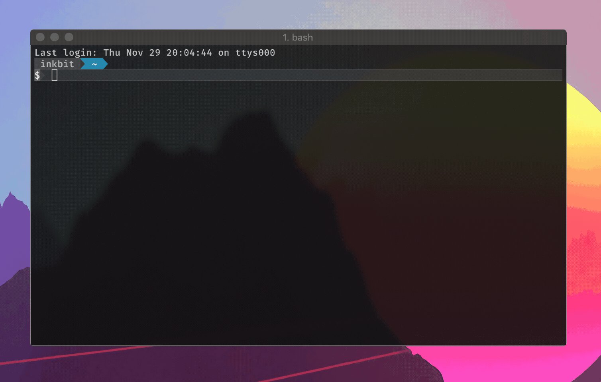

# quest-cli

_A command-line client for the UWaterloo Quest Information System._

[![Release][release-img]][release]
[![Go Report Card][grp-img]][grp]
[![Travis: Build][travis-img]][travis]

Check your grades in style 😎.



| Want to make something else that uses information from Quest?                                                                                             |
| --------------------------------------------------------------------------------------------------------------------------------------------------------- |
| Check out [`uwquest`](https://github.com/stevenxie/uwquest), a Golang client for Quest. This CLI tool is just a fancy wrapper around that client library. |

### Why did I make `quest-cli`?

lol idk tbh

uhhhhh quest web interface bad 😭 💯

## Features

- [x] Login and authentication
- [x] Check grades
- [x] Windows compatibility
- [ ] Check schedule?
- [ ] Check course availability?
- [ ] ??? other stuff ???

[Open an issue](https://github.com/stevenxie/quest-cli/issues/new) to request
a new feature that you want to see added to `quest-cli`!

## Installation

If you're running macOS, you can install this using [Homebrew](https://brew.sh):

```bash
brew install stevenxie/tap/quest-cli
```

Otherwise, grab
[the latest release](https://github.com/stevenxie/quest-cli/releases), unzip it
and run it:

```bash
$ unzip quest-cli-0.1.1-macOS-x86_64
$ cd quest-cli-0.1.1-macOS-x86_64/
$ ./quest --version
0.1.1
```

### Running `quest-cli`

You can double-click the executable file (the `.exe` on Windows) to start
running `quest-cli` in interactive mode.

If you're running `quest-cli` in the terminal, try out the following commands:

```bash
quest login   # save Quest login to ~/.quest-cli.json (password is obfuscated)
quest grades  # check your grades
quest --help  # see other options
```

<br />

## FAQ

#### Will this steal my Quest login?

Yes.

Okay, not really, but don't take that from me; check the source code for
yourself:

- [`quest-cli/internal/interact/quest.go`](https://github.com/stevenxie/quest-cli/blob/master/internal/interact/quest.go)
- [`uwquest/login.go`](https://github.com/stevenxie/uwquest/blob/master/login.go) (underlying Quest accessor library)

Your credentials are sent to the UWaterloo IDP (ID portal) as if you're
logging into the Quest website itself.

[grp]: https://goreportcard.com/report/github.com/stevenxie/quest-cli
[grp-img]: https://goreportcard.com/badge/github.com/stevenxie/quest-cli
[release]: https://github.com/stevenxie/quest-cli/releases
[release-img]: https://img.shields.io/github/release/stevenxie/quest-cli.svg
[travis]: https://travis-ci.com/stevenxie/quest-cli
[travis-img]: https://travis-ci.com/stevenxie/quest-cli.svg?branch=master
